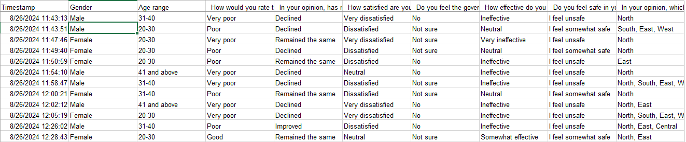
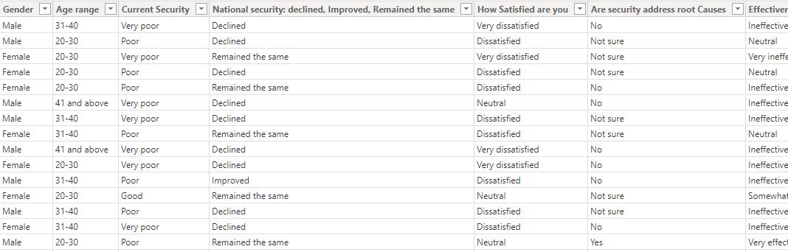

# Analysis-on-Public-Opinion-on-National-security-
## Introduction
This dataset comprises responses from a survey conducted in August 2024, focused on public perception of national security in the country under the current government. It contains various fields that capture demographic information, opinions on security policies, satisfaction levels, and suggestions for improvement. By analyzing this data, key trends in public sentiment can be identified, highlighting areas of concern and potential policy improvements to enhance national safety.
## Data Source
The dataset was collected through an online public opinion survey conducted in August 2024. The survey was designed to gather insights into the general public’s perception of national security, focusing on their experiences, opinions, and assessments of the government’s effectiveness in addressing security issues. The respondents were individuals from diverse demographics, representing different regions of the country. The data was gathered using a structured questionnaire, and participants were asked to provide responses based on their personal experiences and viewpoints.
## Tools
Several tools and techniques were employed to clean, transform, and analyze the dataset to ensure accuracy and derive meaningful insights from the collected responses. These include data processing, error checking, and computation of key metrics. Below are the key processes and tools used:
1. ## Data Cleaning and Transformation
Data cleaning is a crucial step in ensuring that the dataset is accurate, complete, and free of inconsistencies. In this phase, specific operations were performed to handle missing values, remove unnecessary columns, and address errors.

• Timestamp Removal: The Timestamp column, which recorded the date and time when each response was submitted, was removed from the dataset. This step was taken because the timestamp was not critical for the analysis of security perceptions and would not influence the overall results. The removal of this column helped streamline the dataset, making it more focused and easier to analyze.

2. ## Data Analysis and Computation of Metrics
To derive insights from the dataset, certain metrics were calculated using both Power BI, which offer robust data analysis capabilities.

•	Measure for Total Respondents: A key measure was created to calculate the total number of respondents in the dataset. In Power BI, a DAX (Data Analysis Expressions) measure was used for this purpose. The formula counted the unique entries in the dataset (after removing duplicates) to determine the exact number of participants. This metric was essential for understanding the overall sample size and ensuring that the analysis reflected the full range of responses.

## Example of DAX formula used:
                 Total Respondents = COUNTROWS(DISTINCT('Dataset'[Respondent ID]))

4. ## Visualization Tools for Data Insights
To present the results in a visually appealing and understandable manner, Power BI was used for creating visual representations of the data. Key visualizations include bar charts, pie charts, and heat maps, helping to illustrate the distribution of opinions on security, the effectiveness of government policies, and regional variations in perceived security risks.

•	Validation of Regional Responses: Cross-verification was done to ensure that responses for regions facing the greatest security risks were valid and aligned with the country's actual geographical regions.
•	Consistency of Responses: Consistency checks were carried out across related fields (e.g., respondents who indicated feeling "very unsafe" were compared with their corresponding responses about law enforcement effectiveness) to identify any contradictions or irregularities.

## Data Description 
This dataset captures the opinions and perceptions of citizens regarding the national security situation in the country under the current government. The data provides insights into public sentiment about various aspects of security, including the government's effectiveness, law enforcement agencies' performance, and personal safety at the community level. Below is a description of the key fields in the dataset:

1. ## Gender
•	Description: The gender of the respondents.
•	Values:
o	"Male"
o	"Female"

2.  ## Age Range
•	Description: The age group of the respondents.
•	Values:
o	"20-30"
o	"31-40"
o	"41 and above"

3.  ## How would you rate the overall security situation in the country under the current government?
•	Description: Respondents' assessment of the overall security situation in the country under the current administration.
•	Values:
o	"Very poor"
o	"Poor"
o	"Good"

4.  ## In your opinion, has national security improved, declined, or remained the same over the past year?
•	Description: Respondents' opinion on how national security has changed over the past year.
•	Values:
o	"Improved"
o	"Declined"
o	"Remained the same"

5.  ## How satisfied are you with the government’s response to recent security threats?
•	Description: Respondents' level of satisfaction with how the government has responded to recent security challenges.
•	Values:
o	"Very dissatisfied"
o	"Dissatisfied"
o	"Neutral"

6.  ## Do you feel the government’s security policies are adequately addressing the root causes of insecurity?
•	Description: Whether respondents believe the current security policies adequately address the fundamental causes of insecurity.
•	Values:
o	"Yes"
o	"No"
o	"Not sure"

7.  ## How effective do you think the current law enforcement agencies are in maintaining peace and security?
•	Description: Respondents' opinion on the effectiveness of law enforcement agencies in ensuring security and peace.
•	Values:
o	"Very ineffective"
o	"Ineffective"
o	"Neutral"
o	"Somewhat effective"

8.  ## Do you feel safe in your community?
•	Description: Respondents' feelings of personal safety within their community.
•	Values:
o	"I feel unsafe"
o	"I feel somewhat safe"

9. In your opinion, which regions in the country face the greatest security risks? (Select all that apply)
•	Description: Respondents' identification of regions they believe face the greatest security risks.
•	Values:
o	"North"
o	"South"
o	"East"
o	"West"
o	"Central"

11.  ## What actions do you think the government should prioritize to improve national security? (Select all that apply)
•	Description: Suggested actions that respondents believe the government should prioritize to enhance national security.
•	Values:
o	"Tackling poverty and unemployment"
o	"Investing in cybersecurity"
o	"Strengthening law enforcement"
o	"Increasing military presence"

12.  ## Do you believe that community-based security measures (e.g., neighborhood watch, vigilantes) should be increased to improve safety?
•	Description: Respondents’ opinion on whether community-based security measures, such as neighborhood watches or vigilantes, should be increased.
•	Values:
o	"Yes"
o	"Not sure"

## Problem Statement
Here are several problem statements that can be derived from the dataset on public opinion regarding national security:

1.  ## Deterioration of Public Perception on National Security
•	Problem Statement: A significant portion of the population believes that national security has declined under the current government. What factors contribute to the negative perception of security in the country, and how can the government address the root causes of insecurity as identified by citizens?

2. ## Dissatisfaction with Government’s Response to Security Threats
•	Problem Statement: There is a high level of dissatisfaction among respondents with the government’s response to recent security threats. What specific actions or policies are failing, and how can the government improve its response to ongoing security challenges?

3.  ## Perceived Ineffectiveness of Law Enforcement Agencies
•	Problem Statement: A majority of respondents feel that law enforcement agencies are ineffective in maintaining peace and security. What are the main challenges faced by law enforcement agencies, and what measures can be implemented to enhance their effectiveness in combating insecurity?

4.  ## Regional Disparities in Security Risks
•	Problem Statement: Respondents identified certain regions (e.g., North, East, South) as facing greater security risks. What are the specific security challenges in these regions, and how can region-specific strategies be developed to address them effectively?

5.  ## Lack of Safety in Communities
•	Problem Statement: Many respondents reported feeling unsafe in their communities. What are the underlying factors contributing to the lack of safety, and what community-based or government-led initiatives can be introduced to improve security at the local level?

6. ## Need for Community-Based Security Measures
•	Problem Statement: A large number of respondents believe that community-based security measures (such as neighborhood watch and vigilantes) should be increased. How effective are current community-based initiatives, and what role can they play in enhancing national and local security?

7.  ## Government's Failure to Address Root Causes of Insecurity
•	Problem Statement: Many respondents feel that the government’s security policies do not adequately address the root causes of insecurity, such as poverty and unemployment. How can government policies be reformed or expanded to tackle the socio-economic issues that contribute to insecurity?

8. ## Policy and Action Priorities for Improving National Security
•	Problem Statement: Respondents identified key priorities, such as tackling poverty and unemployment and strengthening law enforcement, as crucial to improving national security. What specific strategies should the government implement to address these priorities, and how can they be tailored to different regions?

## Recommendation

1. ## Enhance Government Transparency and Communication
•	Recommendation: The government should prioritize transparent communication about its security strategies and efforts. Public dissatisfaction often arises from a lack of clarity about the steps being taken to improve security. Regular updates and public briefings on progress can help address these concerns and rebuild trust.

2. ## Strengthen Law Enforcement Agencies
•	Recommendation: Improve the effectiveness of law enforcement agencies by investing in better training, equipment, and resources. Additionally, implementing accountability measures to monitor the performance of law enforcement officers will help ensure that they are contributing to peace and security in a more efficient manner.

3. ## Address the Root Causes of Insecurity
•	Recommendation: The government should focus on tackling the root causes of insecurity, such as poverty and unemployment. Implementing economic empowerment programs, creating job opportunities, and offering social welfare programs can reduce the socio-economic factors that contribute to insecurity in various regions.

4. ## Regional Security Solutions
•	Recommendation: Develop region-specific security strategies that address the unique challenges faced by different areas, especially in the North and other identified high-risk regions. For example, increasing military presence in more volatile areas and supporting development projects in underserved regions could reduce regional disparities in security risks.

5. ## Community-Based Security Initiatives
•	Recommendation: Strengthen community-based security initiatives, such as neighborhood watch programs and partnerships with local vigilante groups, to complement formal law enforcement. Community-led safety measures should be better organized and integrated into broader security strategies, ensuring they have adequate support from government authorities.

6. ## Improved Response to Security Threats
•	Recommendation: The government must improve its response to security threats by acting swiftly and decisively in crisis situations. Establishing rapid response units or increasing military presence in security hotspots could enhance public confidence in the government’s ability to manage security crises effectively.

7. ## Leverage Technology and Cybersecurity
•	Recommendation: As identified by some respondents, the government should invest in cybersecurity and other modern technologies to strengthen its capacity to combat emerging threats. By investing in intelligence gathering, digital surveillance, and cybersecurity, the government can better address both physical and digital threats.

8. ## Inclusive Policy Development
•	Recommendation: The government should involve key stakeholders, including local communities, civil society organizations, and experts in policy formulation and review processes. Public input can help ensure that security policies reflect the actual concerns and needs of citizens, resulting in more inclusive and effective solutions.

9. ## Public Safety Awareness Programs
•	Recommendation: Implement public safety awareness campaigns to educate citizens on ways to enhance security within their communities. These campaigns can also provide guidance on how to collaborate with law enforcement agencies and report suspicious activities, thereby improving overall community vigilance.

10. ## Regular Security Assessments
•	Recommendation: The government should conduct regular assessments of security policies and the effectiveness of law enforcement agencies. By gathering continuous feedback from citizens and conducting independent reviews, the government can adjust its policies based on the evolving security landscape and public sentiment.
By implementing these recommendations, the government can address the public's concerns about national security, strengthen law enforcement, and enhance safety in communities.

